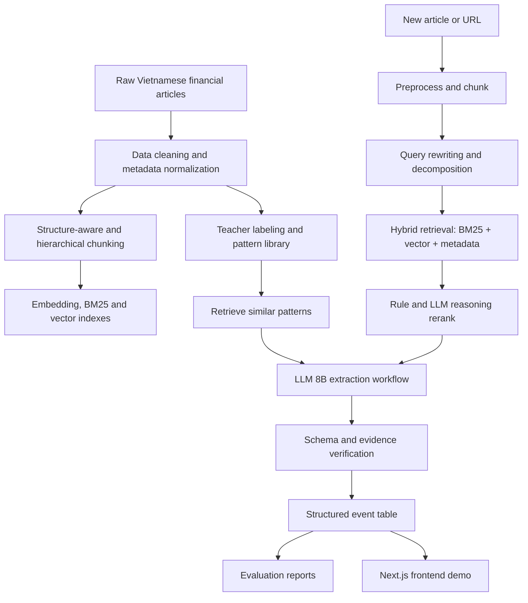

# Project Overview

## Tên đề tài

**FinEvent-VN: Hệ thống workflow trích xuất và cấu trúc hóa sự kiện tài chính doanh nghiệp từ báo tài chính tiếng Việt bằng NLP/LLM**

## Bối cảnh

Báo cáo tài chính doanh nghiệp thường công bố theo quý hoặc theo năm, nên thông tin có độ trễ. Trong khi đó, báo điện tử tài chính và các nguồn tin doanh nghiệp cập nhật hằng ngày các sự kiện có thể ảnh hưởng đến cổ phiếu hoặc triển vọng kinh doanh.

Ví dụ sự kiện:

- Công ty ký hợp đồng lớn hoặc trúng thầu.
- Doanh nghiệp M&A, hợp tác chiến lược, đầu tư lĩnh vực mới.
- Tăng vốn điều lệ, phát hành cổ phiếu hoặc trái phiếu.
- Thay đổi lãnh đạo cấp cao.
- Mở rộng nhà máy, thị trường, dự án.
- Bị điều tra, kiện tụng, khủng hoảng, xử phạt.

Project xây dựng một workflow biến bài báo tiếng Việt phi cấu trúc thành bảng sự kiện có cấu trúc để phục vụ phân tích đầu tư.

## Định vị kỹ thuật

Project chọn hướng **evidence-grounded NLP pipeline**:

- Không trình bày project như một app RAG hỏi đáp thuần túy.
- RAG được dùng như tầng truy xuất evidence, pattern và context để hỗ trợ extraction.
- Lõi NLP là phát hiện sự kiện, phân loại `event_type`/`event_subtype`, slot filling `event_arguments`, xác định `impact_sentiment` và kiểm định evidence.
- Không train lại toàn bộ reasoning của LLM 8B trong v1.
- Tập trung chia nhỏ bài toán thành các bước có thể đo lường: cleaning, chunking, retrieval, reranking, extraction, verification, evaluation.
- Có thí nghiệm về embedding model, retrieval strategy, reranking, prompt strategy, schema nhãn, attention/reranker head và loss proxy nếu cần.

Lý do: với dữ liệu ban đầu nhỏ và nhãn sinh theo weak supervision, fine-tune toàn bộ reasoning end-to-end dễ tốn tài nguyên, khó kiểm soát lỗi và có nguy cơ chỉ học tốt các mẫu đã gặp. Trong bài toán trích xuất thông tin có cấu trúc, lỗi có thể đến từ parsing, retrieval, prompt, schema hoặc hallucination, nên train lại toàn bộ model không nhất thiết giải quyết đúng nguyên nhân. Workflow tốt giúp kiểm soát từng nguồn lỗi, đo được bước nào làm giảm độ chính xác, từ đó mới quyết định có cần train module nhỏ tại điểm nghẽn như embedding/reranker/extract classifier hay không.

Luận điểm thực nghiệm của project là: **chất lượng hệ thống đến từ sự kết hợp giữa NLP task design và workflow grounding**, không chỉ từ việc train thêm model. Vì vậy, project sẽ so sánh các cấu hình retrieval, reranking, prompting, schema và verification để chứng minh thành phần nào thật sự cải thiện kết quả.

## Mục tiêu

1. Thu thập tập dữ liệu mới gồm bài báo tài chính tiếng Việt.
2. Xây dựng schema chuẩn cho sự kiện doanh nghiệp.
3. Xây dựng workflow trích xuất sự kiện từ bài báo thành JSON/bảng.
4. So sánh nhiều phương án retrieval, prompting, schema nhãn và model.
5. Đánh giá định lượng độ chính xác của hệ thống.
6. Dựng app demo cơ bản để nhập link/text và hiển thị bảng sự kiện.

## Không nằm trong phạm vi v1

- Dự đoán giá cổ phiếu.
- Khuyến nghị mua/bán.
- Phân tích kỹ thuật hoặc định giá doanh nghiệp.
- Xử lý dữ liệu mạng xã hội nhiễu cao.
- Xây dựng LLM từ đầu hoặc fine-tune toàn bộ model 8B.

## Kiến trúc tổng thể

## Module chính

| Module | Nhiệm vụ |
| --- | --- |
| Data workflow | Crawl, clean, deduplicate, metadata chuẩn |
| Event schema | Định nghĩa output chuẩn và taxonomy sự kiện |
| RAG preparation | Structure-aware chunking, hierarchical chunks, embedding, BM25/vector indexes |
| Embedding retrieval | Tìm bài báo/pattern liên quan bằng BM25, vector, metadata và reranking |
| Pattern library | Lưu ví dụ chuẩn do teacher LLM tạo và hệ thống auto-validate |
| LLM extraction | Dùng model 8B sinh output theo schema |
| Verification | Kiểm tra JSON, enum, evidence, groundedness và hallucination |
| Evaluation | Đo metric từng bước và end-to-end |
| Demo app | Cho người dùng thử pipeline |

## Công nghệ đề xuất

| Nhóm | Công nghệ |
| --- | --- |
| Ngôn ngữ | Python 3.11+ |
| Python environment | Miniconda + `environment.yml` |
| Python package manager | `uv` chạy trong conda env, `pyproject.toml`, `requirements.lock` |
| Project metadata | `pyproject.toml` cho package metadata và tool config |
| Crawl | `requests`, `BeautifulSoup`, `trafilatura`; Playwright nếu trang cần render JS |
| Lưu dữ liệu raw/processed | JSONL |
| Primary DB | PostgreSQL + pgvector |
| DB migration | SQLAlchemy + Alembic |
| Embedding | Cloudflare Workers AI embedding đã có sẵn; so sánh thêm BGE-M3, multilingual E5, GTE multilingual |
| Vector search | pgvector mặc định; FAISS làm baseline offline |
| Lexical search | PostgreSQL full-text/trigram + BM25 experiment baseline |
| Workflow runtime | LangGraph cho workflow online; Typer CLI cho batch workflows |
| API backend | FastAPI |
| LLM | Qwen/Llama/Mistral 7B-8B instruct chạy local/API |
| Validation | Pydantic hoặc JSON Schema |
| Evaluation | scikit-learn, pandas |
| Frontend | Next.js + TypeScript gọi FastAPI, không chứa core logic |

## Success Criteria

Project v1 được xem là hoàn thành khi:

- Có ít nhất 100 bài báo tài chính tiếng Việt được thu thập và làm sạch.
- Có ít nhất 60-100 bài được teacher LLM gán nhãn và pass auto validation làm gold/pattern set vận hành.
- Hệ thống sinh được bảng sự kiện đúng schema cho bài báo mới.
- Có báo cáo metric cho retrieval, extraction và end-to-end.
- Có ít nhất 3 nhóm thí nghiệm: embedding/retrieval/rerank, model/prompt, schema nhãn hoặc verification ablation.
- Có app demo nhập link/text và hiển thị kết quả từng bước.

## Rủi ro chính

| Rủi ro | Cách kiểm soát |
| --- | --- |
| Bài báo không chứa sự kiện rõ ràng | Thêm class `NO_EVENT`, đo false positive |
| LLM bịa thông tin | Bắt buộc evidence span, validate với văn bản gốc |
| Bị xem là RAG thuần túy | Trình bày theo [rag-nlp-positioning.md](rag-nlp-positioning.md), nhấn mạnh event extraction và slot filling |
| Dữ liệu ít và lệch nhãn | Chia taxonomy vừa đủ, dùng macro-F1, bổ sung dữ liệu theo class thiếu |
| Nhiều công ty trong một bài | Cho phép nhiều event records trong một bài |
| Ticker không xuất hiện trực tiếp | Dùng mapping company-name-to-ticker, trả confidence thấp nếu không chắc |
