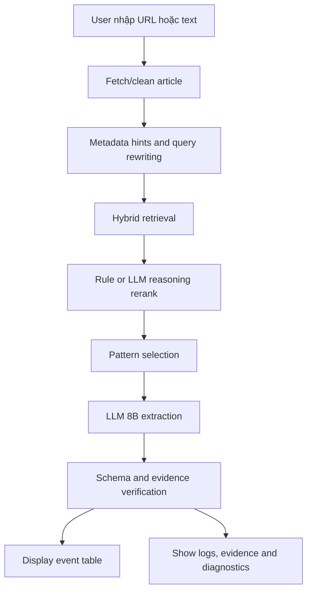

# Demo App Workflow

## Mục tiêu

Xây dựng ứng dụng demo cơ bản để người dùng nhập link hoặc text bài báo và xem hệ thống trích xuất bảng sự kiện doanh nghiệp.

App không cần đầy đủ tính năng production. Mục tiêu là chứng minh thuật toán/workflow chạy được, có log từng bước và có output dễ hiểu.

## Công nghệ

- Next.js + TypeScript.
- Frontend gọi FastAPI endpoint chạy LangGraph workflow online.
- Tailwind CSS hoặc shadcn/ui để dựng UI nhanh và nhất quán.
- PostgreSQL + pgvector cho metadata, labels, embeddings và run logs.
- FAISS baseline nếu user chọn cấu hình ablation.
- BM25 index local cho lexical retrieval.

## User Flow



## Input

App hỗ trợ 2 chế độ:

### 1. URL Mode

```text
https://cafef.vn/...
```

Backend fetch HTML, extract title/text/date/source.

### 2. Text Mode

```text
Người dùng paste tiêu đề và nội dung bài báo.
```

Nếu không có URL, `source_url=null`.

## Output UI

### Khu vực 1: Article Preview

Hiển thị:

- Title.
- Source URL.
- Published date nếu có.
- Ticker hints.
- Text preview.

### Khu vực 2: Retrieval Results

Bảng:

| Rank | Source | Ticker | BM25 | Vector | Rerank | Excerpt |
| --- | --- | --- | --- | --- | --- | --- |

Cho phép expand xem context.

Nếu dùng LLM reasoning rerank, hiển thị thêm:

- relevance label
- reasoning summary
- evidence span của candidate

### Khu vực 3: Pattern Examples

Bảng:

| Pattern | Event type | Similarity | Example output |
| --- | --- | --- | --- |

### Khu vực 4: Extraction Result

Bảng sự kiện:

| Ticker | Company | Event type | Subtype | Summary | Impact sentiment | Confidence |
| --- | --- | --- | --- | --- | --- | --- |

Mỗi dòng có nút/expander xem `evidence_span`.

### Khu vực 5: Verification Report

Hiển thị:

- Schema valid hay không.
- Evidence coverage.
- Unsupported fields.
- Dropped events.
- Repair attempts.
- Hallucination warnings.

### Khu vực 6: Diagnostics

Hiển thị:

- Prompt version.
- Model name.
- Retrieval config.
- Rerank config.
- Validation status.
- Warnings.
- Latency từng bước.
- Raw JSON output.

## Backend Steps

### Step 1: Normalize Input

Nếu user nhập URL:

1. Fetch page.
2. Extract text.
3. Tạo `article_id=temp_<timestamp>`.

Nếu user nhập text:

1. Tách title nếu có.
2. Dùng toàn bộ text làm body.

### Step 2: Call FastAPI workflow

Next.js frontend gọi FastAPI để chạy workflow:

```ts
const response = await fetch(`${process.env.NEXT_PUBLIC_API_URL}/extract`, {
  method: "POST",
  headers: { "Content-Type": "application/json" },
  body: JSON.stringify({ article, run_config }),
});

const result = await response.json();
```

Nếu test module riêng không qua API:

```python
retrieved_contexts = retrieval_engine.search(article, top_k=50)
reranked_contexts = reranker.rerank(article, retrieved_contexts, top_k=5)
```

### Step 3: Select Patterns

```python
patterns = pattern_store.search(article, top_k=3)
```

### Step 4: Run Extraction

```python
result = extractor.extract(
    article=article,
    contexts=retrieved_contexts,
    patterns=patterns,
)
```

### Step 5: Validate and Display

```python
verified = verifier.verify_and_repair(result)
```

Nếu validation/verification fail:

- Hiển thị warning.
- Không crash app.
- Cho phép tải raw output để debug.

## Metrics trong app

App nên hiển thị runtime metrics:

| Metric | Mô tả |
| --- | --- |
| Retrieval latency | Thời gian tìm context |
| LLM latency | Thời gian model sinh output |
| Validation latency | Thời gian validate/repair |
| Verification latency | Thời gian kiểm định evidence |
| Total latency | Tổng thời gian |
| Number of events | Số event trích xuất |
| Average confidence | Confidence trung bình |
| Evidence coverage | Tỷ lệ field có evidence |
| Hallucinated field count | Số field không có căn cứ |

## Demo Script khi bảo vệ

1. Mở app.
2. Paste một bài báo có sự kiện rõ, ví dụ ký hợp đồng/trúng thầu.
3. Cho thấy retrieval tìm được bài/pattern tương tự.
4. Cho thấy LLM sinh bảng JSON hợp lệ.
5. Click evidence span để chứng minh output có căn cứ.
6. Paste một bài phân tích chung không có sự kiện.
7. Cho thấy hệ thống trả `NO_EVENT`.

## Failure Cases

| Case | UI behavior |
| --- | --- |
| URL không fetch được | Hiển thị lỗi và gợi ý dùng Text Mode |
| Không có retrieval result | Vẫn chạy extraction, gắn warning |
| LLM timeout | Hiển thị timeout, cho retry |
| JSON invalid sau repair | Hiển thị raw output và validation errors |
| Không có event | Hiển thị trạng thái `NO_EVENT`, không hiển thị bảng rỗng khó hiểu |

## File đề xuất

```text
frontend/
  app/
    page.tsx
    runs/[runId]/page.tsx
  components/
    ArticleInput.tsx
    RetrievalTrace.tsx
    PatternTable.tsx
    EventTable.tsx
    VerificationPanel.tsx
  lib/
    api.ts
    types.ts
    schemas.ts
```

Frontend chỉ điều phối UI và gọi FastAPI. Logic retrieval/extraction/validation nằm ở backend Python để có thể test độc lập.

## Acceptance Criteria v1

- Chạy được bằng `pnpm dev` hoặc `npm run dev` trong thư mục `frontend/`.
- Nhập text bài báo và nhận bảng sự kiện.
- Hiển thị retrieval, pattern, evidence và raw JSON.
- Không crash khi model trả lỗi hoặc JSON invalid.
- Có ít nhất 2 ví dụ demo: `HAS_EVENT` và `NO_EVENT`.
